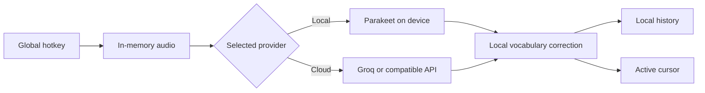

# AgentWisper

[](https://github.com/Rajveerx11/AgentWisper/actions/workflows/test.yml)
[](https://github.com/Rajveerx11/AgentWisper/releases)
[](LICENSE)
[](#requirements)

Local-first voice dictation for developers, AI engineers, and people who speak
in APIs, package names, infrastructure terms, and project-specific identifiers.

AgentWisper runs as a lightweight Windows desktop app. Hold a global hotkey,
speak, release, and receive corrected text at the active cursor. Use local
Parakeet inference, Groq, or a custom OpenAI-compatible transcription provider.

> **Project status:** AgentWisper is an early-stage open-source project. Core
> dictation works, but interfaces and storage formats may still evolve before
> version 1.0.

## Why AgentWisper

General dictation often turns names such as `Supabase`, `pgvector`, `kubectl`,
or an internal service identifier into ordinary words. AgentWisper adds a local
technical correction layer after transcription:

- select one optional repository to learn dependency and filename spellings;
- teach corrections directly from transcript history;
- keep project terms and learned mappings on the PC;
- remove any learned mapping from Settings.

Repository content is never executed, edited, or inserted into cloud prompts.

## Highlights

- Native Windows desktop lifecycle with Start Menu and Installed Apps entries
- Right Ctrl push-to-talk by default; any single key can be captured in Settings
- Persistent, always-on-top Signal Node for recording and processing state
- Local Parakeet TDT 0.6B v3 inference with background model preloading
- Groq and custom OpenAI-compatible transcription providers
- Project-aware and user-taught developer vocabulary
- Local SQLite transcript history
- Automatic cursor paste with clipboard restoration
- Windows DPAPI encryption for cloud API keys
- Local HTML, CSS, and JavaScript interface in WebView2; no Electron runtime
- No account, analytics, saved audio, online database, or background web server

## How it works



See [Architecture](docs/ARCHITECTURE.md) for component and privacy boundaries.

## Requirements

- Windows 10 or Windows 11, x64
- WebView2 Runtime
- Microphone access
- Python 3.11 and [uv](https://docs.astral.sh/uv/) for source development
- A compatible Parakeet model directory for local transcription, or a cloud
  provider API key

The local model is intentionally not bundled. AgentWisper looks for
`parakeet-tdt-0.6b-v3-int8` in these locations:

```text
%APPDATA%\orca\speech-models\
%APPDATA%\com.pais.handy\models\
%APPDATA%\October\voice-models\
```

The selected folder must contain:

```text
encoder.int8.onnx
decoder.int8.onnx
joiner.int8.onnx
tokens.txt
```

## Install

### Build and install for the current Windows user

```powershell
uv venv .venv --python 3.11
uv sync --extra dev
.\build.ps1
.\install.ps1 -Launch
```

This installs AgentWisper to
`%LOCALAPPDATA%\Programs\AgentWisper`, creates a Start Menu shortcut, and
registers an uninstaller. Private data remains under
`%APPDATA%\AgentWisper`.

### Run from source

```powershell
uv sync --extra dev
.\run-app.ps1
```

### Uninstall

```powershell
& "$env:LOCALAPPDATA\Programs\AgentWisper\uninstall.ps1"
```

Uninstalling keeps settings, vocabulary, and transcript history. Remove
`%APPDATA%\AgentWisper` manually only when that data is no longer needed.

## Usage

1. Launch AgentWisper from the Start Menu.
2. Open **Settings** and choose Local Parakeet, Groq, or Custom API.
3. Confirm the microphone and hotkey.
4. Optional: choose a local project folder for exact technical spellings.
5. Hold the hotkey, speak, and release it to transcribe.
6. Use **Teach correction** in History when a technical term is wrong.

Closing the main window hides it. The global hotkey and Signal Node continue
running until `AgentWisper.exe` is ended or the app is uninstalled.

## Providers and privacy

| Provider | Audio destination | API key storage | Vocabulary behavior |
| --- | --- | --- | --- |
| Local Parakeet | Stays in memory on the PC | Not required | Applied locally |
| Groq | Sent to Groq when selected | DPAPI-encrypted | Applied locally after transcription |
| Custom API | Sent to the configured HTTPS endpoint | DPAPI-encrypted | Applied locally after transcription |

Plain HTTP custom endpoints are accepted only for `localhost`. Project terms,
learned mappings, clipboard content, and history are not added to cloud
requests.

Local files:

```text
%APPDATA%\AgentWisper\settings.json
%APPDATA%\AgentWisper\secrets.json
%APPDATA%\AgentWisper\vocabulary.json
%APPDATA%\AgentWisper\history.db
```

Audio is discarded after transcription. See [Security Policy](SECURITY.md) for
the supported reporting process and security boundaries.

## Developer vocabulary limits

Repository scanning is intentionally bounded:

- maximum 2,000 inspected files;
- dependency, build, cache, and VCS directories skipped;
- maximum 1 MB read from each supported manifest;
- maximum 2,000 manifest dependency entries;
- maximum 500 project terms;
- maximum 500 learned heard-to-spelling mappings.

These limits keep startup and post-transcription correction predictable.

## Development

```powershell
uv sync --locked --extra dev
uv run ruff check src tests
uv run ruff format --check src tests
uv run pytest
node --check src\agent_whisper\web\app.js
uv build
.\build.ps1
```

The Windows package is written to
`dist\AgentWisper\AgentWisper.exe`. The package includes AgentWisper's license,
notices, and collected runtime dependency license files; it does not include
the speech model.

### Project layout

```text
src/agent_whisper/gui.py          WebView2 host and desktop lifecycle
src/agent_whisper/desktop.py      Recording and transcription controller
src/agent_whisper/overlay.py      Always-on-top Signal Node
src/agent_whisper/web/            Local HTML, CSS, and JavaScript interface
src/agent_whisper/providers.py    Local and cloud transcription providers
src/agent_whisper/storage.py      Settings, encrypted secrets, and history
src/agent_whisper/vocabulary.py   Project and learned correction engine
tests/                             Automated behavior and regression tests
.github/workflows/                CI and release automation
```

## Releases

CI runs on pull requests and `main`. Version tags matching `v*.*.*` trigger the
Windows release workflow, which verifies the tag against the package version,
builds the app, publishes a ZIP and SHA-256 checksum, and creates a GitHub
Release.

Release history is maintained in [CHANGELOG.md](CHANGELOG.md).

## Contributing

Bug reports, focused features, documentation, and tests are welcome. Read
[CONTRIBUTING.md](CONTRIBUTING.md) before opening a pull request. Participation
is governed by the [Code of Conduct](CODE_OF_CONDUCT.md).

## License

AgentWisper is licensed under the [MIT License](LICENSE). Third-party runtime
components remain under their respective licenses; see
[THIRD_PARTY_NOTICES.md](THIRD_PARTY_NOTICES.md).
