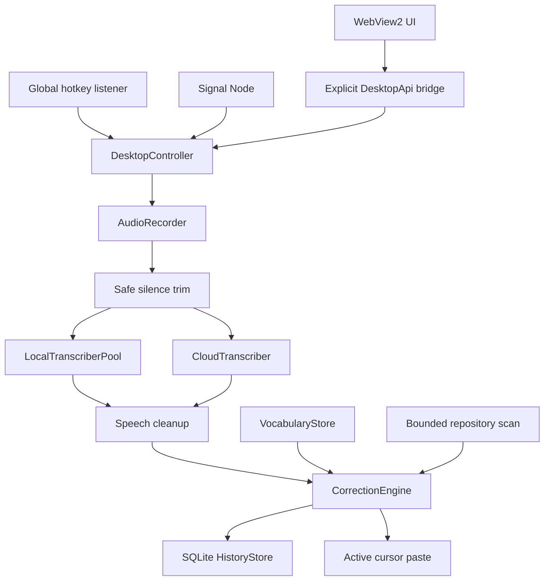
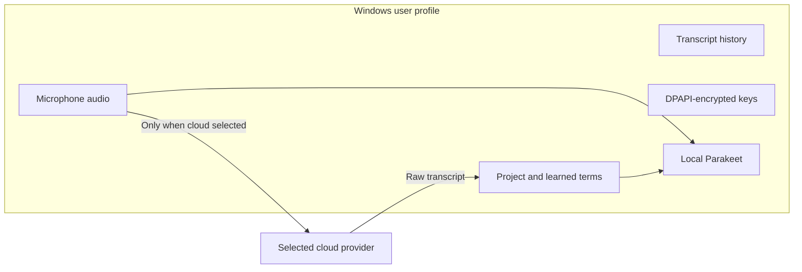

# AgentWisper Architecture

## System overview

AgentWisper is a Windows desktop process with local WebView2 management and
Signal Node UIs, a global push-to-talk listener, and one
selected transcription provider. No local HTTP server or Electron runtime is
used.

## Main components

| Component | Responsibility |
| --- | --- |
| `gui.py` | Single-instance Windows lifecycle, WebView2 host, explicit bridge methods |
| `desktop.py` | Thread-safe recording, provider, correction, history, and paste orchestration |
| `overlay.py` | Persistent HTML Signal Node host and desktop bridge |
| `audio.py` | Microphone stream, real-time levels, and safe silence trimming |
| `providers.py` | Local model pooling and cloud transcription requests |
| `vocabulary.py` | Built-in, repository, and learned technical correction rules |
| `storage.py` | Versioned settings, DPAPI secrets, vocabulary JSON, SQLite history |
| `windows_runtime.py` | Named single-instance objects and per-user login registration |
| `web/` | Local HTML, CSS, and JavaScript application UI |
| `overlay_web/` | Local HTML, CSS, and JavaScript Signal Node UI |

## Dictation lifecycle

1. Hotkey press captures the current external foreground window and starts the
   microphone stream.
2. Hotkey release keeps a 120 ms tail, stops recording, and snapshots settings.
3. Clear leading and trailing silence is trimmed with 240 ms safety padding.
4. The selected local or cloud provider transcribes the in-memory audio.
5. Optional conservative speech cleanup removes high-confidence fillers.
6. `CorrectionEngine` applies learned, repository, then built-in rules without
   cascading over newly inserted spellings.
7. When enabled, the previous foreground window is restored and the corrected
   text is pasted. Existing clipboard text is restored on a best-effort basis.
8. Corrected and raw text are stored locally in SQLite.

Controller states are `idle`, `listening`, `transcribing`, `success`, and
`error`. The controller lock protects transitions and settings replacement.

## Windows background lifecycle

1. The primary process owns a named mutex and a named reopen event.
2. Closing the management window cancels destruction and hides it. The
   controller, global hotkey listener, and Signal Node process stay active.
3. A second launch signals the reopen event and exits; the primary process
   restores its existing window instead of starting duplicate listeners.
4. The optional current-user `Run` registration starts that same executable at
   Windows sign-in. Saving the setting refreshes the executable path.
5. **Quit AgentWisper** destroys the management window, then the shutdown path
   stops the overlay, hotkey listener, timers, recording, and named objects.

The Signal Node runs in a child process so its topmost WebView stays responsive
while transcription work runs. The child sets per-monitor DPI awareness before
creating its window, clips the host window to the same 18-pixel radius as its
HTML surface, and repositions against the active monitor work area when the
main window enters the background.

## Privacy boundaries

- Repository terms and learned corrections do not enter cloud prompts.
- Audio is not saved by AgentWisper.
- History and settings remain in `%APPDATA%\AgentWisper`.
- Cloud privacy and retention are controlled by the chosen provider.

## Repository vocabulary bounds

The repository scanner follows no symlinks, skips common dependency/build/cache
directories, inspects at most 2,000 files, reads at most 1 MB per supported
manifest, and returns at most 500 usable terms. Learned storage accepts at most
500 mappings and 20 spoken forms for one exact spelling.

## Packaging

PyInstaller creates an onedir Windows distribution. The ONNX speech model stays
external. The package includes:

- AgentWisper executable and runtime dependencies;
- local WebView UI assets;
- project license and notices;
- available license files for bundled runtime Python distributions.

Tag-based release automation verifies that the Git tag matches
`agent_whisper.__version__`, creates a ZIP, produces a SHA-256 checksum, and
publishes both to GitHub Releases.

## Design constraints

- Windows is the only promised platform.
- The main window may hide, but the process and hotkey remain active.
- Cloud use must be explicit and accurately labeled.
- No repository execution, telemetry, account system, or background web server.
- New persistent controls require a frequent developer-dictation use case.
